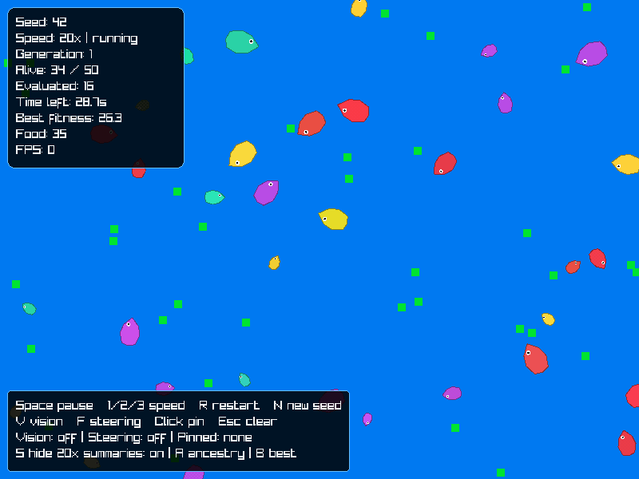
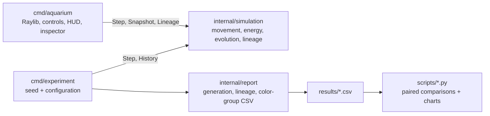
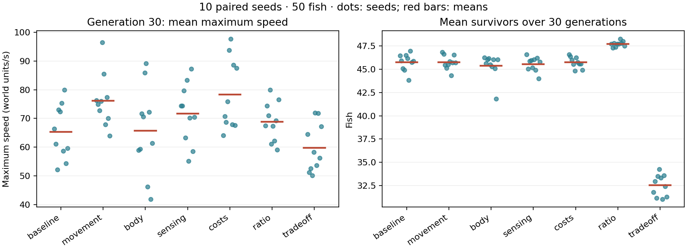

# Aquarium

Watch fish evolve inherited traits as they compete for food and prey in a Go simulation with a Raylib interface.



## Install requirements

Install [Go **1.27.1+**](https://go.dev/dl/) and the platform dependencies below
for the default cgo build. Check your Go version with `go version`.

You do **not** need to install Raylib separately: `raylib-go` includes the C
source and compiles it with the Go bindings. You need a C compiler and the
system graphics libraries. See the [binding's requirements](https://github.com/gen2brain/raylib-go#requirements).

### macOS

Install Apple's Command Line Tools (skip if you have Xcode or the tools):

```sh
xcode-select --install
```

Use the Go installer linked above. The Apple SDK provides the required system
frameworks. See [Raylib's macOS guide](https://github.com/raysan5/raylib/wiki/Working-on-macOS)
for toolchain troubleshooting.

### Linux

Install Go from the link above if your distribution packages an older version.
Install the compiler and OpenGL, X11, and Wayland development libraries:

**Debian / Ubuntu**

```sh
sudo apt update
sudo apt install build-essential libgl1-mesa-dev libx11-dev libxi-dev \
  libxcursor-dev libxrandr-dev libxinerama-dev libwayland-dev libxkbcommon-dev
```

**Fedora**

```sh
sudo dnf install gcc mesa-libGL-devel libX11-devel libXi-devel \
  libXcursor-devel libXrandr-devel libXinerama-devel wayland-devel libxkbcommon-devel
```

Run the app in a graphical desktop session with OpenGL 3.3 support. For other
distributions, see [Raylib's Linux guide](https://github.com/raysan5/raylib/wiki/Working-on-GNU-Linux).

### Windows

Install Go and a C compiler such as MinGW-w64, with `gcc` on your `PATH`.
Follow [Raylib's Windows guide](https://github.com/raysan5/raylib/wiki/Working-on-Windows)
for toolchain setup, and check the [Go binding's Windows requirements](https://github.com/gen2brain/raylib-go#windows)
for binding-specific details.

You need Python and `uv` only for the chart scripts; see [Tests and benchmarks](#tests-and-benchmarks).
For headless experiments and core tests, you can use Go without the graphics dependencies.

## Run and controls

From the cloned repository root, download the Go dependencies and launch:

```sh
go mod download
go run ./cmd/aquarium
```

Start with seed 42, 50 fish, and 35 food items. Advance the simulation at fixed
1/60-second steps; each generation lasts up to 30 simulated seconds.

| Input | Action |
| --- | --- |
| Space | Pause / resume |
| `1` / `2` / `3` | Set speed to 1× / 5× / 20× |
| `R` / `N` | Restart the same seed / start a new seed |
| Hover / click fish | Inspect / pin inspector |
| Escape | Close ancestry and unpin |
| `V` / `F` | Toggle pinned fish's vision / steering vectors |
| `A` / `B` | Inspect pinned fish's ancestry / last generation's best fish |
| `S` | Toggle generation summaries at 20× |

Use the HUD to track generations and fitness, and the inspector to compare
traits, parents, and color groups. Vector overlays show direction, not magnitude.
At high load, the 40-step frame cap can reduce the effective simulation speed.

## Genetic algorithm

1. **Initialize:** sample size, maximum speed, vision, metabolism, three behavior
   weights, and RGB color for each fish.
2. **Evaluate:** let fish feed, move, and hunt until the generation timer expires
   or the population dies out. Score living and dead fish with
   `fitness = age_seconds + 5 × food_eaten + 10 × fish_eaten`.
3. **Select:** copy the best genome into one elite offspring. For each remaining
   child, pick two parents through separate four-draw tournaments with replacement.
4. **Breed:** average the parents' traits and RGB channels. Mutate each numeric
   trait with probability 0.15, adding up to ±10% of its legal range and clamping
   at the bounds. With probability 0.15, jitter one color channel by up to ±15.
5. **Replace:** spawn a full cohort with new IDs; retain parent IDs and repeat.

Fish pay hunger costs for movement (actual speed squared), size, and vision.
Larger fish have lower steering acceleration. Predators need a size advantage
and sufficient color distance. For the equations and bounds, see the
[experiment notes](docs/experiments/evolutionary-tradeoffs.md#rules).

## Architecture



Keep world rules in `internal/simulation`, which has no graphics dependency.
Use `New(config, seed)`, `Step(dt)`, and `Snapshot()` to embed the simulation.
With the same seed, configuration, and step sequence, you can replay a run.
Snapshots and lineage queries return copies.

Track ancestry across ten completed generations plus the current cohort.
Treat color groups as RGB clusters within a sample; group IDs do not identify
species across generations.

## Experiments

Compare **7 treatments × 10 paired seeds × 30 generations**, with 50 fish,
35 respawning food items, and 30 seconds per generation.

| Metric | Zero-cost baseline | Combined treatment |
| --- | ---: | ---: |
| Mean best fitness | 175.54 | 128.03 |
| Mean survivors | 45.75 | 32.52 |
| Final mean size | 28.24 | 26.97 |
| Final mean maximum speed | 65.29 | 59.72 |

Average fitness and survivors across seeds and generations; average final traits
across seeds at generation 30, including dead fish.



With the combined treatment, fish evolved smaller sizes in 8/10 seed pairs and
lower maximum speeds in 7/10. Survival fell in 10/10 pairs. With movement cost
alone, fish evolved *higher* maximum speeds in 9/10 pairs. Increased feeding
under higher hunger is a possible explanation.

The combined treatment changes energy costs, steering acceleration, and predation
ratio together, so you cannot attribute its effects to one parameter. Ten seeds
and 30 generations provide limited evidence for stable niches. See the
[full results and limitations](docs/experiments/evolutionary-tradeoffs.md).
The app uses predation ratio **1.0**; the combined experiment uses **1.2**.

```sh
# Rerun all 70 experiments and regenerate the summary CSV.
python3 scripts/tradeoff_experiment.py

# Or recompute the summary from the committed CSVs.
python3 scripts/tradeoff_experiment.py --summarize-only

# Run a headless experiment with optional ancestry and color-group exports.
go run ./cmd/experiment -seed 42 -generations 30 -run-id demo-42 \
  -output /tmp/generations.csv -lineage-output /tmp/lineage.csv \
  -groups-output /tmp/groups.csv
```

Use `go run ./cmd/experiment -h` for parameters. Supply a distinct `-run-id` for
separate runs; reuse it for byte-identical replay checks.

## Tests and benchmarks

```sh
go test ./...
go vet ./...

# Test the core, reports, and integration flows without graphics dependencies.
CGO_ENABLED=0 go test ./internal/simulation ./internal/report ./tests/integration
```

Check genome bounds, energy accounting, steering and predation rules, lineage,
CSV exports, and deterministic replay across generations with the Go tests.

After cloning, install `uv` and run these commands from the repository root.
Create the local Python environment once:

```sh
uv venv --python 3.12 scripts/.venv
uv pip install --python scripts/.venv/bin/python -r scripts/requirements.txt
```

Run the charts without activating the environment:

```sh
scripts/.venv/bin/python scripts/plot_experiments.py
scripts/.venv/bin/python scripts/plot_benchmarks.py
```

Keep `scripts/.venv` on your machine; Git ignores it. On Windows, use
`scripts/.venv/Scripts/python.exe` in place of `scripts/.venv/bin/python`.
The experiment chart needs only the saved CSVs; the benchmark also needs Go.

Generate the experiment chart from the committed generation CSVs. For benchmarks,
measure initialization plus 60 simulation steps at 50, 100, 250, and 500 initial
fish, using seed 42, default rules, one CPU, and five repeats. Fish can die during
the workload. Exclude rendering and snapshot copying; interpret timing as cost
per workload, not display FPS or steady-state cost per fish.

See the [benchmark chart](results/benchmarks/benchmark.png), with raw Go output,
environment details, and per-repeat CSV in `results/benchmarks/`. On an Apple M4
with Go 1.27.1, median workload times were 0.68 / 1.70 / 3.85 / 4.42 ms for
50 / 100 / 250 / 500 initial fish. Compare timings on the same machine and toolchain.
To run the benchmark without Python:

```sh
CGO_ENABLED=0 go test ./internal/simulation -run='^$' \
  -bench='^BenchmarkCohort60Steps$' -benchmem -benchtime=1s -count=5 -cpu=1
```
